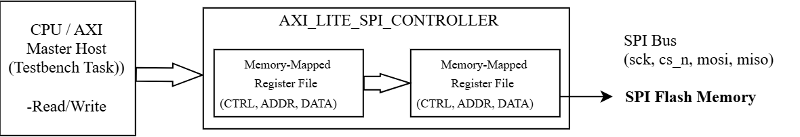
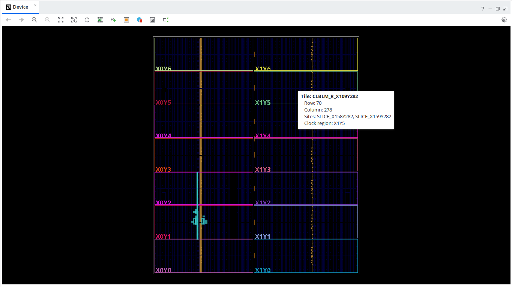
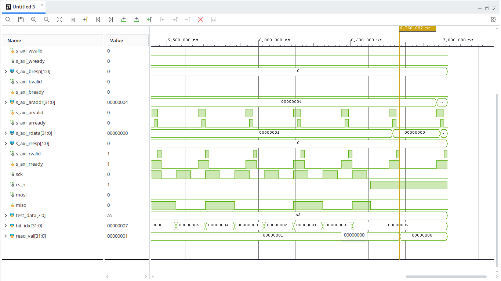

# AXI4-Lite SPI Memory Controller IP Core

A synthesizable, ultra-lightweight **AXI4-Lite Slave SPI Flash Controller IP Core** designed in Verilog. This core bridges CPU Memory-Mapped register transactions with physical SPI Flash memory peripherals (NOR Flash).

---

## 🔑 Key Features
* **Full AXI4-Lite Slave Compliance:** Supports standard 32-bit single word read/write channel handshakes (`AW`, `W`, `B`, `AR`, `R`).
* **Memory-Mapped Control:** Integrated 32-bit Register File providing software drivers complete control over SPI transactions.
* **Hardware Execution Engine:** FSM-driven SPI master handling automatic Command, 24-bit Address phase shifting, and Data Tx/Rx.
* **Fully Synthesizable & Timing Closed:** Verified with zero latch warnings, achieving positive setup/hold slack at 100 MHz target clock.

---

## 📐 Hardware Architecture

### Register Map
The core exposes a standard 32-bit Memory-Mapped Register interface:

| Offset | Register Name | Access | Reset Value | Field Description |
| :---: | :---: | :---: | :---: | :--- |
| `0x00` | **CTRL** | R/W | `0x00000000` | **[0]:** Start Pulse (Auto-clearing) **[1]:** Operation Mode (`0` = Read, `1` = Write) |
| `0x04` | **STATUS** | R-Only | `0x00000000` | **[0]:** Busy Flag (`1` = SPI Transfer Active, `0` = Idle) |
| `0x08` | **ADDR** | R/W | `0x00000000` | **[23:0]:** 24-bit Target Flash Byte Address |
| `0x0C` | **DATA_W** | R/W | `0x00000000` | **[7:0]:** Byte Payload for Page Write Operations |
| `0x10` | **DATA_R** | R-Only | `0x00000000` | **[7:0]:** Received Byte Payload from Flash Memory Read |

---

## 📊 Physical Implementation & Metrics

The IP core was synthesized and implemented targeting a **Xilinx Virtex-7 FPGA (`xc7vx485tffg1157-1`)** using AMD Vivado.

### 📊 Resource Utilization Report (Vivado Implementation)

The IP core was synthesized and implemented on a **Xilinx Virtex-7 FPGA (`xc7vx485tffg1157-1`)**. The resource footprint is optimized for low-power, resource-constrained SoC designs:

| Resource | Used | Available | Utilization % | Breakdown / Functional Description |
| :--- | :---: | :---: | :---: | :--- |
| **Slice LUTs** | **193** | 303,600 | **< 0.1%** | **119** LUTs in `spi_core_inst`, **74** LUTs for AXI decoder & CSR |
| **Slice Registers (FFs)** | **206** | 607,200 | **< 0.1%** | **64** FFs for SPI FSM, **142** FFs for control/status registers |
| **Slices** | **82** | 75,900 | **< 0.1%** | Physical FPGA logic slices occupied |
| **LUT as Logic** | **193** | 303,600 | **< 0.1%** | Combinational logic functions |
| **Bonded IOB (I/O Pins)** | **100** | 600 | **16.67%** | Top-level AXI-Lite bus and SPI physical interface pins |
| **BUFGCTRL (Clock Buffers)**| **1** | 32 | **3.12%** | Primary global clock buffer (`clk`) |

> **Resource Efficiency Highlight:** The entire SPI core controller (`spi_flash_controller.v`) consumes only **119 LUTs** and **64 Flip-Flops**, ensuring minimal area overhead when integrated as an IP block in larger System-on-Chip (SoC) architectures.

### Timing Closure Results (100 MHz Target / 10ns Period)
* **Worst Negative Slack (WNS):** `+5.301 ns` (PASS)
* **Worst Hold Slack (WHS):** `+0.113 ns` (PASS)
* **Maximum Achievable Frequency ($F_{\text{MAX}}$):** $\approx 212.8\text{ MHz}$
* **Failing Endpoints:** `0`

---

## 🧪 Verification & Simulation

Functional verification was conducted in Vivado Behavioral Simulator using a custom top-level AXI-Lite Master testbench (`tb_axi_lite_spi.v`) and an integrated SPI Flash behavioral slave module.

* **Test Sequence:**
  1. Issues AXI Write to `ADDR` register (`0x08`) with flash address `0x00123456`.
  2. Issues AXI Write to `CTRL` register (`0x00`) setting Read Mode and asserting `Start`.
  3. Executes an AXI polling loop reading `STATUS` register (`0x04`) until `Busy` clears to `0`.
  4. Reads `DATA_R` register (`0x10`) and verifies received payload matches memory drive.

---

## 🚀 Future Roadmap & Planned Extensions

- [ ] **Quad-SPI (QSPI) Upgrade:** Extend PHY interface to support 4-bit parallel data I/O lines (`IO0`–`IO3`).
- [ ] **FIFO Integration:** Add $16 \times 8$-bit Tx/Rx FIFO buffers to enable continuous burst transfers.
- [ ] **Interrupt Controller:** Add hardware interrupt line (`o_irq`) to eliminate CPU register polling loops.
- [ ] **Embedded C Driver:** Add C hardware abstraction header (`spi_driver.h`) for bare-metal RISC-V / ARM microcontrollers.

---

## 📜 License
This project is licensed under the MIT License - see the [LICENSE](LICENSE) file for details.